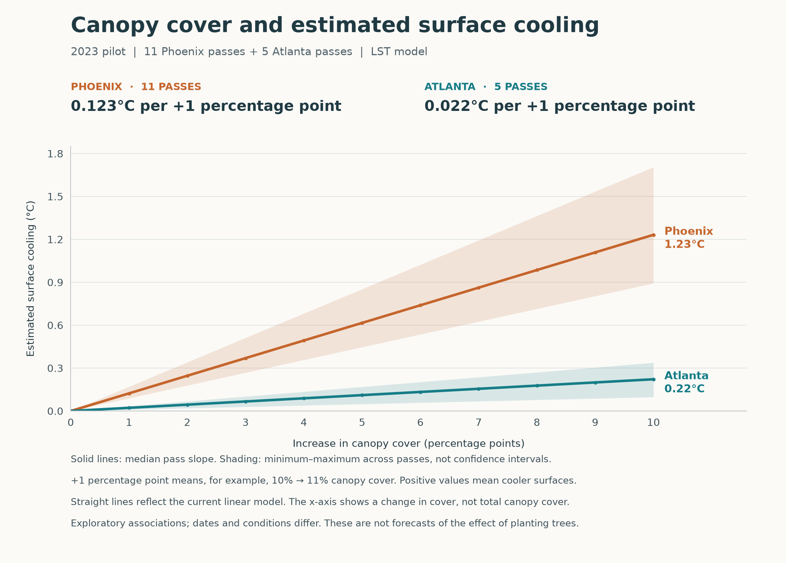

# Canopy percentage and surface cooling — 2023 pilot

Created at the user's request on 30 September 2026 from the previously disclosed 11 Phoenix and 5 Atlanta pass gradients. This is a descriptive visualization of the existing temperature-space fits, not a new model or a scale-agreement ruling.



| City | Passes | Median cooling per +1 percentage point | Median cooling per +10 percentage points | Across-pass range per +1 percentage point |
| --- | ---: | ---: | ---: | ---: |
| Phoenix | 11 | 0.1232 °C | 1.2319 °C | 0.0893–0.1705 °C |
| Atlanta | 5 | 0.0222 °C | 0.2218 °C | 0.0097–0.0338 °C |

The source is `outputs/v6_2/scientific/exploratory_review_20260921/pass_gradients_exploratory.csv`, released under its adjacent `gradient_disclosure.json`. The current graph does not open sealed model files, new robustness effects, thermal rasters or time comparisons. The separate other-year Phoenix extension is excluded.

## How to read the graph

The x-axis is an increase in canopy cover measured in **percentage points**: 10% to 11% is +1 percentage point. Zero on this axis means zero change in cover, not a surface with no trees. The y-axis is the corresponding fitted reduction in mixed-pixel land-surface temperature; positive means cooler. A temperature difference of 1 K equals a difference of 1 °C.

For each pass, the conversion is:

`cooling_C = -gradient_K_per_10pp × canopy_increase_percentage_points / 10`

This follows the existing linear canopy term with the same block intercept and other covariates held fixed. It requires no new fit or absolute-temperature prediction. It is not the emitted-energy model's fourth-root temperature-equivalent conversion.

Solid lines use the unweighted median of the existing pass slopes within each city. This descriptive summary is not a pooled city coefficient, a season-standardized estimate or a new primary estimator. Shading spans the smallest to largest pass slope. It is **not a confidence interval**. Existing 8 km spatial-bootstrap interval endpoints for each individual slope are included in `pass_slopes.csv` for reference, but not plotted as a city interval.

The straight lines reflect the current linear model's assumption; they do not establish that the real response stays linear across all canopy levels. The graph is limited to differences of 0–10 percentage points, does not select or certify a new absolute canopy reference pair, and must not be extrapolated to a 0–100% response curve. The original scale analysis's reference distribution and supported pair remain unchanged.

These are exploratory, conditional surface-temperature associations. The cities were observed on different dates and under different conditions. The graph neither isolates a causal city difference nor predicts the temperature effect of planting trees. Temperature-scale agreement, nonlinear sensitivity and the time/season issues remain unresolved.

## Files and verification

- `canopy_cooling_per_percentage_point.png` and `.pdf`: viewable and exportable graph.
- `cooling_by_increment.csv`: the median and across-pass range at every integer percentage-point increment from 0 through 10.
- `pass_slopes.csv`: all 16 source slopes with dates, solar times and existing spatial uncertainty endpoints.
- `summary.json` and `disclosure.json`: numerical summary, scope and source checksums.
- `render_graph.py`: reproducible plotting code, with known-answer unit/sign checks and exact reconciliation to the released +10-point values.
- `SHA256SUMS`: hashes of this package's files.

The saved PNG was visually checked. No observations, model specifications, historical results or prior review packages were changed, and nothing was pushed to GitHub.

Reproduce from the project root with the existing analysis environment:

```sh
/Users/jmlee/miniforge3/envs/urbanv2/bin/python deliverables/Canopy_Cooling_Graph_v6_2_20260930/render_graph.py
```

Regenerate this package's checksum manifest after intentionally regenerating outputs; its disclosure timestamp will change.
