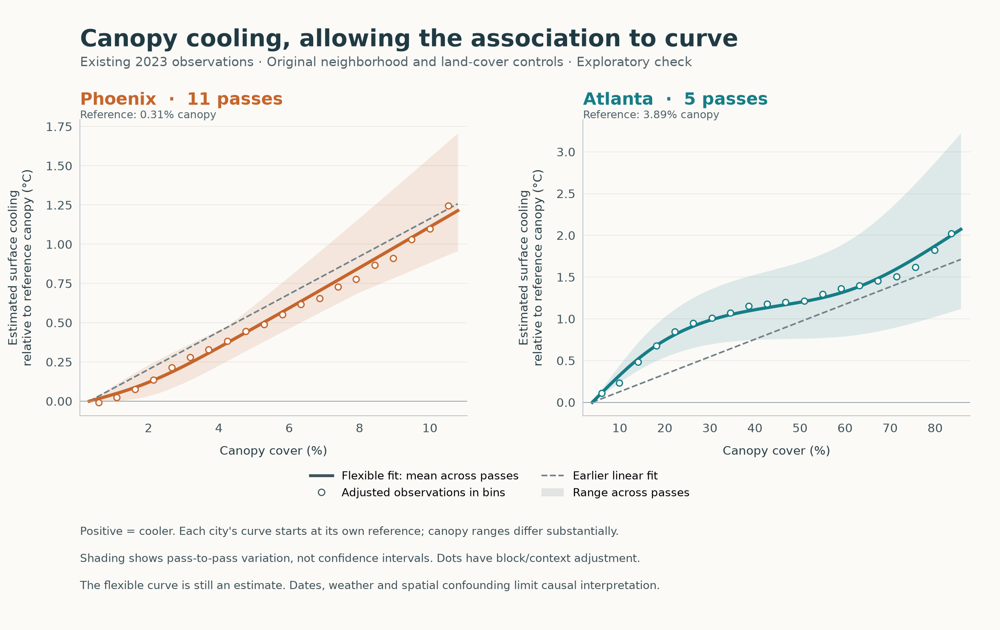
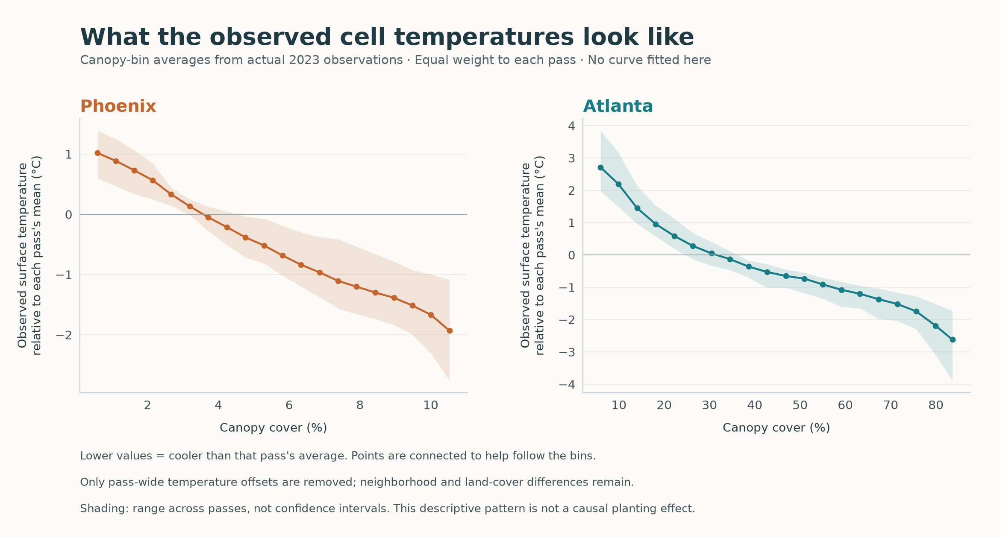

# Nonlinear canopy association — exploratory 2023 check

The user requested the association in the underlying observations after seeing a graph that simply rescaled the original constant slopes. This package fits a flexible canopy curve to the existing 11 Phoenix and 5 Atlanta passes, with the original block intercepts and six context controls. The primary v6.2 estimator remains unchanged.



The solid line is the **equal-pass mean of the flexible fitted curves**. Open circles are binned partial residuals: observed temperatures after removing the fitted block and context contributions, expressed as cooling relative to the reference canopy. These adjusted observations depend on the adjustment model; they are not unadjusted raw temperatures. The dashed line shows the mean of the earlier linear fits over the same range and from the same reference. Shading spans the pass curves and is **not a confidence interval**.

Phoenix is fairly close to linear over the displayed range, with some curvature at its low-cover end. Atlanta has more curvature: the estimated association is steeper at low canopy cover, flatter in the middle, and steeper again at high cover. Neither a plateau nor a change point was imposed or established. This is an exploratory estimated association, not a verified causal response to planting trees.

| Quantity | Phoenix | Atlanta |
| --- | ---: | ---: |
| Passes, all 2023 | 11 | 5 |
| Displayed canopy range | 0.314–10.792% | 3.894–85.690% |
| Reference canopy | 0.314% | 3.894% |
| Mean fitted cooling at upper endpoint relative to reference | 1.214 °C | 2.072 °C |
| Maximum absolute difference from the mean linear curve within this display range | 0.101 °C | 0.443 °C |
| Minimum number of blocks spanning reference and target, across all grid points and passes | 923 | 825 |

The references and canopy ranges differ, so the endpoint values are not comparable city cooling efficiencies. Dates and conditions also differ. The displayed range is the intersection of each city's pass-specific canopy P05–P95 intervals. It is not the full canopy range, nor a newly adopted inclusion cutoff: all original eligible cells, including the tails, remained in the fits.

## Direct observed-temperature view



These points use actual LST values grouped into canopy bins, with each pass's overall mean temperature subtracted before averaging passes equally. Lower means cooler than that pass's average. No smooth response curve is fitted in this view. The connecting segments only help follow the points. Block and land-cover differences are **not** removed here, so this plot does not isolate the conditional canopy association. Its vertical reference differs from the adjusted plot.

## What changed from the previous graph

The previous graph converted each single linear slope into a straight line. This analysis returns to the existing native-cell observations and permits curvature. Both current comparison lines use equal-pass arithmetic means; the earlier standalone straight-line graph used median pass slopes. No claim of improved out-of-sample prediction or statistical confirmation of curvature is made.

Examples from the mean adjusted curve illustrate why the per-percentage-point association is no longer constant:

| City | Canopy change | Additional fitted cooling |
| --- | --- | ---: |
| Phoenix | 1% → 2% | 0.077 °C |
| Phoenix | 5% → 6% | 0.127 °C |
| Atlanta | 10% → 11% | 0.050 °C |
| Atlanta | 40% → 41% | 0.009 °C |
| Atlanta | 80% → 81% | 0.034 °C |

These are model-based exploratory comparisons within the displayed range, not planting forecasts. Every complete integer percentage-point step is provided in `cooling_for_each_additional_percentage_point.csv`.

## Method and prospective choices for this check

The dated design is `docs/v2/v6_2/execution/nonlinear_association_20260930/design.json`; numerical canopy-only settings and the 16 input checksums are in its adjacent `numeric_support_freeze.json`. They were saved before nonlinear fitting. Existing linear effects had already been disclosed, so this is not a blinded confirmatory analysis.

Each city uses a four-knot restricted cubic regression spline: one linear canopy term and two nonlinear terms, transformed before within-block centering. The knots are the mean across passes of their canopy 5th, 35th, 65th and 95th percentiles. The basis and quantile convention follow [Hmisc's restricted cubic spline documentation](https://search.r-project.org/CRAN/refmans/Hmisc/html/rcspline.eval.html) and [the author's implementation](https://github.com/harrelfe/Hmisc/blob/master/R/rcspline.eval.s). Taking the mean of those quantiles across passes is an explicitly recorded analyst choice. No sign, monotonicity, curvature or plateau constraint is imposed.

The 20 bin edges, display range, reference and 201-point grid were determined from canopy support without inspecting the new outcomes. The grid also includes integer canopy percentages. No pass or bin was removed to obtain a favorable curve, and no replacement canopy-span cutoff was added. Bin counts and reference-to-target spanning-block counts are retained.

Both LST and emitted energy use the same native cells, spline terms, original six context controls, block intercepts, unit weights and spatial bootstrap draws. Geometry and season are not added as controls here; VPD remains descriptive. The emitted-energy fit is retained internally in sealed model storage. This graph is not the standardized fourth-root conversion, a new time model or a final scale-agreement ruling. No prior sealed time contrasts or registration/common-cell effect changes were opened.

## Uncertainty and verification

All 16 paired fits completed on **7,511,083 cell-pass observations**. These include repeat observations of places across passes and must not be treated as independent temporal samples. All **16,000 requested bootstrap draws** were estimable, using whole 8 km spatial groups with each original block verified to be contained in one group. This resampling remains an assumption about spatial dependence, not proof of independence at 8 km.

The public `individual_pass_curves.csv` includes per-pass **pointwise** 95% spatial-bootstrap percentile intervals. No city-level confidence band is constructed by treating correlated pass estimates as independent. The visual bands only describe across-pass variation, and the mean curves condition on these selected dates rather than representing a season-standardized population response.

Checks passed for input hashes, unique native physical cells, emitted-energy physics, block nesting and exact recovery of all 16 previously disclosed linear slopes on the same input cells. Seven network-free known-answer tests cover the spline basis against an independent natural cubic interpolator, curved and linear recovery under block/context adjustment, paired bootstrap draws, reference/units, duplicate/split-block rejection and empty-bin handling. Both PNG figures were visually inspected.

## Files and reproduction

- `adjusted_nonlinear_association.png` / `.pdf`: adjusted flexible curve, bin points and linear comparison.
- `observed_binned_association.png` / `.pdf`: directly observed temperature-bin pattern after removing pass-wide temperature offsets.
- `mean_adjusted_curves.csv`: equal-pass mean curves and across-pass ranges.
- `binned_observations.csv`: aggregated adjusted and observed bin points, counts and pass contributions.
- `individual_pass_curves.csv` / `individual_pass_bins.csv`: pass-level curves, uncertainty, support and binned summaries.
- `cooling_for_each_additional_percentage_point.csv`: fitted differences for each complete integer percentage-point step.
- `fit_diagnostics.csv`, `summary.json`, `disclosure.json`, `verification.json`, `SHA256SUMS`: provenance and checks.

Code lives in `src/v6_2_advance/nonlinear_association.py`, `run_nonlinear_association.py` and `plot_nonlinear_association.py`. Full paired model coefficients and bootstrap arrays are stored with restricted permissions under `outputs/v6_2/sealed_coefficients/nonlinear_association_20260930/`; this package only releases the user-requested LST curves and binned summaries.

```sh
OPENBLAS_NUM_THREADS=1 OMP_NUM_THREADS=1 /Users/jmlee/miniforge3/envs/urbanv2/bin/python -m unittest discover -s tests/v6_2_advance -p test_nonlinear_association.py -v
OPENBLAS_NUM_THREADS=1 OMP_NUM_THREADS=1 /Users/jmlee/miniforge3/envs/urbanv2/bin/python src/v6_2_advance/run_nonlinear_association.py
OPENBLAS_NUM_THREADS=1 OMP_NUM_THREADS=1 /Users/jmlee/miniforge3/envs/urbanv2/bin/python src/v6_2_advance/plot_nonlinear_association.py
```

The execution freeze protects code and input identity. Existing completed fits are reused; changed analysis code must not silently overwrite the freeze. No original analysis files or historical review packages were overwritten, and no GitHub push was performed.
