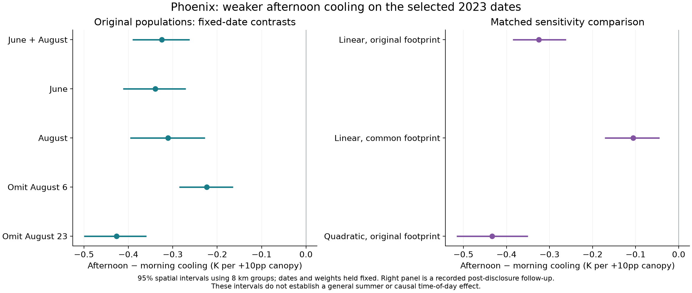
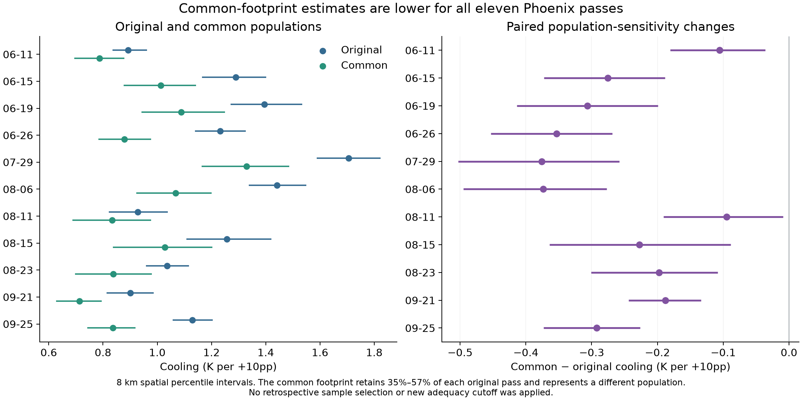
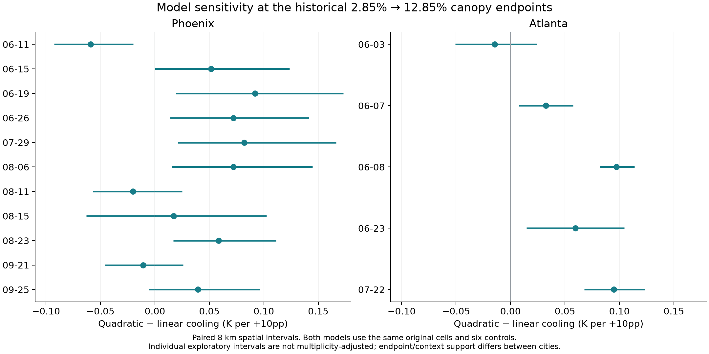
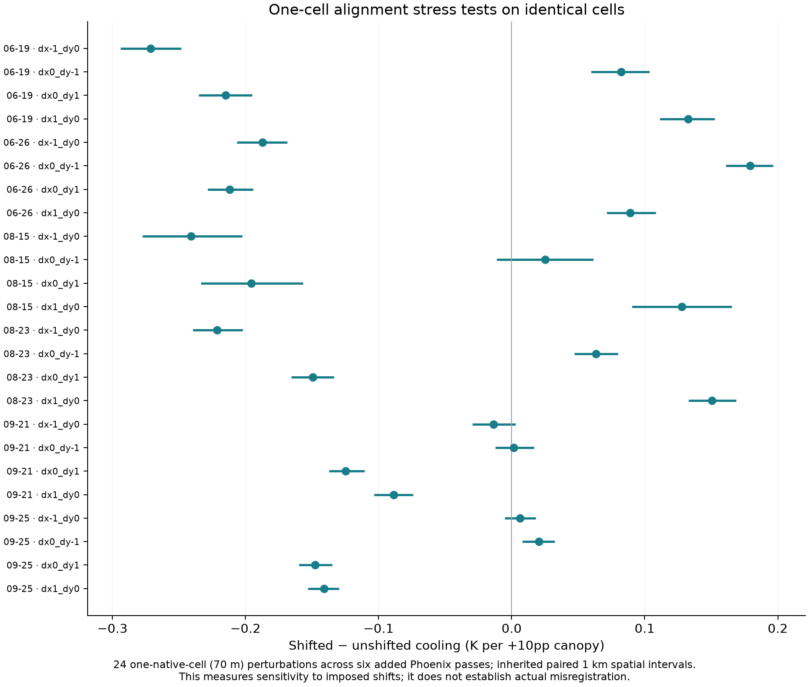
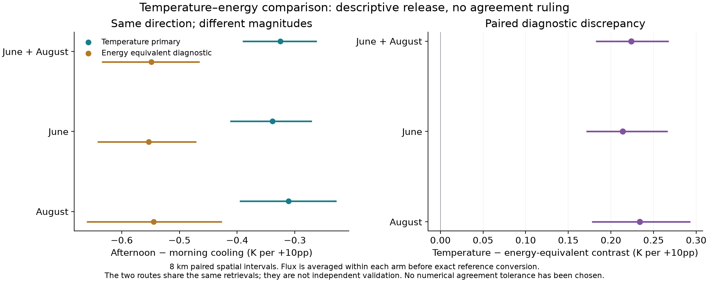

# 2023 canopy-cooling pilot — released results and final review

**Released for exploratory review on 6 October 2026 at the user's request.** The former display restriction is lifted for the current eleven Phoenix and five Atlanta 2023 passes. Temperature remains primary. A formal temperature–energy agreement ruling remains pending a numerical tolerance; that does not prevent reviewing these results. Any later margin must acknowledge this disclosure.

**The pilot shows positive canopy-associated surface cooling in every sampled pass. On the five selected Phoenix dates, the afternoon cooling association is weaker than the morning association. That direction persists in the examined footprint and quadratic checks, but its magnitude changes substantially. The data do not establish a general summer diurnal or causal clock effect.**

This package completes the previously deferred effect review, provides released tables and figures, and adds one explicitly recorded post-disclosure joint-uncertainty check. It retains the original sample, controls, endpoint pair and primary model. It does not select a preferred result by sign or authorize study expansion.

## 1. What the original observations show

The original linear cooling estimates range from **0.893–1.705 K per +10 percentage points of canopy in Phoenix** and **0.097–0.338 K in Atlanta**. Every individual existing 8 km spatial-bootstrap interval is above zero. These are conditional associations in mixed-pixel surface temperature, not isolated tree temperatures or causal predictions of planting additional trees.

Phoenix and Atlanta have very different canopy/context support: original median canopy is approximately 2.5%–3.0% versus 28%–34%. Equal units and controls do not make their populations interchangeable, so the ranges should not be presented as a causal ranking of city cooling efficiency. The [sixteen-pass summary](pilot_pass_summary.csv) combines the original estimates, diagnostic equivalents and completed weather inputs with exact acquisition identities and Collection `002` labels.

## 2. Phoenix's sampled afternoon–morning difference

The frozen comparison gives June and August equal weight within each arm. June11 and August11 supply the afternoon observations; June26, August6 and August23 supply the morning observations. The windows are 15:00–18:00 and 09:30–11:30 apparent solar time, not exact observations at 16:00 and 10:30.

| Original linear model, original populations | Afternoon − morning cooling | 95% spatial interval, 8 km |
| --- | ---: | ---: |
| June + August | **−0.325** | **[−0.391, −0.262]** |
| June | −0.339 | [−0.412, −0.271] |
| August | −0.311 | [−0.396, −0.228] |
| Omit August6, retain the frozen month/arm structure | −0.224 | [−0.285, −0.164] |
| Omit August23, retain the frozen month/arm structure | −0.426 | [−0.500, −0.359] |

All values are K per +10 percentage points of canopy. The weighted morning cooling association is 1.235 K/+10pp and the afternoon association is 0.910 K/+10pp. Both indicate cooling; the negative difference means a weaker association on the sampled afternoon dates.

The two supported date deletions change the combined point by ±0.101 K/+10pp, while retaining its negative sign. The other three deletions—June11, June26 and August11—empty a required month/arm and remain unsupported. We therefore cannot claim that every date passed a leave-one-out robustness test.

The intervals condition on the dates, populations, mean models and spatial resampling assumptions. Different dates supply the two arms. For example, the modeled air temperature on June26 morning is about 5.6°C higher than on June11 afternoon; rainfall, winds, viewing conditions and represented geography also vary. These results do not isolate the effect of moving the clock on an otherwise identical day.

## 3. Footprint and model choices change the magnitude

The all-eleven common Phoenix footprint contains 196,090 native cells and retains only 35%–57% of each original pass. It differs in elevation, imperviousness and distance to water as well as extent. With unchanged linear mean models, **all eleven common-footprint cooling estimates are lower**, by 0.095–0.376 K/+10pp, or approximately 10.2%–28.7% of their original estimates. Each individual paired 8 km change interval excludes zero. This is a population sensitivity, not a correction that automatically replaces the baseline.

The initial release showed that applying the same five-date weights to those stored points reduced the time difference. To evaluate that change properly, a post-disclosure follow-up froze new shared physical-group draws across all five dates and three existing model/population variants. It reconstructed all fifteen old points before resampling. It did not add observations, change the six controls or select new endpoints.

| Combined Phoenix comparison: matched follow-up | Estimate | 95% spatial interval, 8 km |
| --- | ---: | ---: |
| Original linear, original populations | −0.325 | [−0.385, −0.262] |
| Original linear, common footprint | **−0.106** | **[−0.171, −0.045]** |
| Quadratic, original populations | **−0.433** | **[−0.516, −0.350]** |
| Common minus original time contrast | +0.219 | [+0.162, +0.278] |
| Quadratic minus original time contrast | −0.108 | [−0.154, −0.072] |

Units are K/+10pp. The original point is unchanged; its slightly different follow-up interval reflects a fresh, prospectively recorded joint draw sequence. The original Step7 interval above is preserved. The negative conditional contrast persists in these checks, but the common footprint reduces its absolute size by about two thirds, while the quadratic model increases it by about one third. A single magnitude should not be presented as insensitive to the represented population or functional form.

Four of the 1,000 coarse-group draws were non-estimable for the common-footprint models. Every failure exactly coincided with omitting the common sample's bare-cover information, which occupies ten blocks in five 8 km groups. The failures were retained, not replaced, and all six controls were kept. Common-related intervals use the 996 estimable draws. The original and quadratic variants had all 1,000 estimable draws at each group size. In total, 29,980 of 30,000 pass/variant fits across the two group sizes were estimable.

## 4. Quadratic fitting matters for some contrasts

At the unchanged historical endpoints—approximately 2.85% to 12.85% canopy—quadratic-minus-linear cooling changes range from **−0.059 to +0.092 K/+10pp in Phoenix**, and **−0.014 to +0.097 K/+10pp in Atlanta**. Six of eleven Phoenix and four of five Atlanta individual paired 8 km change intervals exclude zero. These are exploratory, unadjusted intervals, not a multiplicity-adjusted model-selection test.

The clearest relative change is Atlanta June8: the fitted +10pp cooling contrast rises from **0.097 K** under the linear model to **0.195 K** under the quadratic model. Its paired change is +0.097 K, with interval [+0.082, +0.114]. All sixteen quadratic contrasts at the historical endpoints remain positive. The displayed quadratic point curves increase over their recorded canopy ranges, with varying curvature; no universal plateau, causal response curve or improvement in out-of-sample prediction is established.

The historical upper endpoint is sparsely represented in Phoenix: only about 2.0%–2.5% of cells lie within ±1pp of it, compared with 23.7%–24.9% near the lower endpoint. Block-range coverage and numerical rank are not sufficient proof of conditional overlap. No endpoint was reselected based on the newly viewed effects. The linear model remains the primary frozen model, with the quadratic results as a labeled sensitivity.

## 5. Alignment sensitivity deserves attention

On identical cells, the 24 one-native-cell (70 m) registration perturbations for the six added Phoenix passes change cooling by **−0.271 to +0.179 K/+10pp**. Twenty of their individual paired 1 km spatial intervals exclude zero. Those intervals use 1 km groups; they should not be confused with the 8 km sensitivities above. These are imposed stress tests and do not demonstrate that the imagery actually has a one-cell alignment error.

The 44 available-support perturbations across all eleven Phoenix passes have point changes from −0.270 to +0.246 K/+10pp. Their sample populations also change, and valid paired difference intervals were not established. The released table keeps those interval fields missing rather than inventing them. No global registration or robustness pass/fail cutoff was adopted.

## 6. Temperature and energy give different numerical answers

For the original five-date combined comparison, temperature gives **−0.325 K/+10pp** and the fixed-reference energy-equivalent diagnostic gives **−0.549 K/+10pp**. Their paired difference is **+0.224 K/+10pp**, with 8 km interval **[+0.182, +0.268]**. Both routes indicate weaker afternoon cooling on these dates, but the estimated magnitudes are not interchangeable.

Temperature remains primary. The energy quantity is derived from the same retrievals, so it is not independent validation. Flux changes are averaged within each arm before fixed-reference inversion and then differenced. The reference is 314.774 K and emissivity 0.9474. The earlier reference sensitivity also matters: for example, Phoenix July29's pass-level equivalent ranges from 1.869 to 2.316 K/+10pp over the prescribed ±10 K/±0.01 reference grid, while its direct temperature estimate remains 1.705 K/+10pp. That sensitivity range is not a confidence interval.

The numerical discrepancy can be described now. **Whether it is acceptably small for the intended scale comparison remains undecided:** no numerical agreement margin has been supplied. The 0.10 K SE benchmark is not that margin. A later margin will be post-disclosure and must not be called fixed before these effects were seen. No automatic switch to energy as the primary outcome occurs.

## 7. What the completed review supports

The strongest defensible pilot statement is: **canopy is associated with lower mixed-pixel surface temperature in these sampled passes, and the selected Phoenix dates show a weaker afternoon association under the original, common-footprint and quadratic checks. The size is sensitive to footprint, alignment and model form.**

The pilot does not establish a causal planting effect, a same-day trajectory, a general summer morning–afternoon effect, practical scale equivalence or a city ranking. Step7's 432,000 synthetic datasets showed that candidate day-level interval methods can under-cover under some declared assumptions. Those simulations are not observed effect estimates, and the narrow spatial intervals do not supply additional independent dates. No broader summer interval is adopted.

The numerical and visual review portions previously deferred in Steps3–5 and7 are now complete within this scope. The report is ready for discussion as an exploratory pilot synthesis, not as proof that the full study's temporal target has been resolved. The next priorities are to define the target population explicitly, investigate alignment/composition mechanisms without choosing a favorable subset, and prospectively plan additional independent dates in the thin month/time groups. Current samples and controls remain unchanged. Any further city/year acquisition still needs its own scope decision; nothing has been sent externally.

## Files, provenance and access

- [Sixteen-pass summary](pilot_pass_summary.csv) and [data dictionary](data_dictionary.md).
- [Original fixed-date/monthly/influence results](phoenix_window_comparisons.csv) and [new matched footprint/model intervals](joint_window_sensitivities.csv).
- [Common-footprint results](common_footprint_comparisons.csv), [fixed-support registration](fixed_registration_comparisons.csv), and [available-support points](available_registration_points.csv).
- [Historical-endpoint quadratic results](quadratic_historical_contrasts.csv), [all candidate contrasts](quadratic_all_finite_contrasts.csv), and [all fitted curve points](quadratic_all_curves.csv).
- [Paired pass diagnostics](paired_scale_diagnostics.csv), [reference sensitivities](reference_sensitivity.csv), and [pass-difference figure](paired_pass_review.png).
- [Methods and completed figure captions](methods_and_captions.md), [remaining decisions](next_decisions.md), and [verification](../../docs/v2/v6_2/execution/results_release_20261006/verification.json).

All 161 historical source-result files retain their checksums. Eighty-five source tables/figures have exact released copies under `released_source_artifacts/`; historical “SEALED” labels in those immutable source artifacts describe their creation status, not a current restriction on this 2023 review. All 39 archived effect figures and the six new summary figures were visually reviewed. Raw model/draw storage retains its original filenames and permissions for provenance, with current-pilot access authorized. Other-year results and old original time-contrast files were not included.

The focused follow-up is explicitly post-disclosure exploratory work. Four new known-answer checks passed, the fifteen prior points were reconstructed, failed draws were explained without replacement, and joint interval tables were independently reconciled. No new mean-model specification, scientific inclusion cutoff, thermal acquisition, commit, push or external communication occurred.
