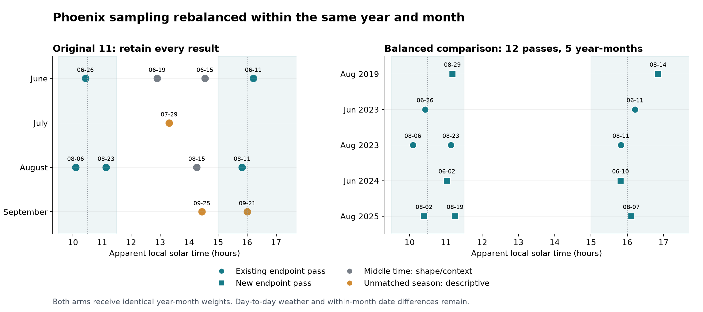

# Phoenix sampling rebalance — v6.2, 21 September 2026

The bounded expansion is complete: **18 Phoenix passes have paired Stage 1 fits**, including seven new acquisitions. **Twelve passes form a balanced morning/afternoon subset across five year-months.** Atlanta remains at five. The original eleven Phoenix results and all historical packages are preserved. New gradients remain sealed; this package reports sample design and precision.

## Why the design changed

The complete cached Collection 2 catalogue contains 547 distinct Phoenix June–September orbit acquisitions in 2019–2025, after local-date filtering and numeric revision deduplication. In 2023 it contains 73 summer acquisitions but **zero July and zero September morning acquisitions in 09:30–11:30 apparent solar time**, before any geometry/cloud exclusion. Those gaps cannot be repaired by searching harder within 2023 or by weighting. Other times remain in the archive ledger.

The broader archive has a few July/September morning opportunities in other years, but the inherited verified geometry frame supplies no supported morning/afternoon pair for those year-months. Unknown geometry remains unresolved, not unsuitable. The present sample therefore supports a June/August comparison; it does not establish a June–September-wide diurnal pattern.

## What was added

The seven additions were frozen using dates, definitive geometry and cloud masks before downloading their thermal layers. Dates and clocks below are Phoenix local civil time (MST, UTC−7); solar time includes longitude and the equation of time. Times are rounded to the nearest minute. This audit uses the earliest scene timestamp in each orbit; some earlier tables used a later representative scene, so displayed times can differ by about one minute without changing the pass identity. Standard errors are K per +10 percentage points canopy, not cooling gradients.

| Orbit | Phoenix date | Clock (MST) | Solar time | 1 km SE | 8 km SE |
|---|---|---|---|---:|---:|
| 06281 | 2019-08-14 | 17:24 | 16:51 | 0.0253 | 0.0542 |
| 06510 | 2019-08-29 | 11:40 | 11:11 | 0.0333 | 0.0561 |
| 33496 | 2024-06-02 | 11:27 | 11:02 | 0.0277 | 0.0551 |
| 33623 | 2024-06-10 | 16:16 | 15:49 | 0.0248 | 0.0474 |
| 40111 | 2025-08-02 | 10:58 | 10:24 | 0.0267 | 0.0543 |
| 40192 | 2025-08-07 | 16:40 | 16:07 | 0.0316 | 0.0526 |
| 40376 | 2025-08-19 | 11:47 | 11:15 | 0.0376 | 0.0458 |

The same block-intercept canopy model was fitted in temperature and emitted-energy space, with matching cells/controls and 1,000 paired bootstrap draws at each 1/2/4/8 km grouping. All seven primary fits completed; 0 of 28,000 requested bootstrap draws were rank failures. New primary SEs range 0.0248–0.0376; 8 km SEs range 0.0458–0.0561. Precision does not establish the time contrast or eliminate spatial dependence.

## How the passes are used

- **Balanced endpoint subset: 12 passes.** August 2019 (2), June 2023 (2), August 2023 (3), June 2024 (2), August 2025 (3). Each year-month gets 20% of each arm's weight, divided equally among its available passes. An extra morning pass therefore does not give that season more influence. Both arms have 40% June and 60% August weight. All selected passes are retained.
- **Middle-time context: 3 passes.** 15 June, 19 June and 15 August 2023 remain available to describe the curve within supported months. They have zero weight in the endpoint-window mean comparison.
- **Unmatched-season description: 3 passes.** 29 July, 21 September and 25 September 2023 remain on the all-pass descriptive plot and in the archive. They have zero weight in this matched-season endpoint comparison. No files or results were deleted.

For S=5 supported year-month strata, endpoint pass i in arm a and stratum s has **arm weight 1/(S × n_sa)**. The weighted afternoon mean minus weighted morning mean defines a window contrast. Its weight is the same in the LST and emitted-energy analyses. The companion design weight is arm weight/2 and sums to one over all twelve passes. The complete manifest and roles are in [all18_pass_roles_and_precision.csv](all18_pass_roles_and_precision.csv).

**This window comparison does not equal an exact 10:30-versus-16:00 prediction.** That original research contrast still requires a frozen continuous-time model and interpolation/support checks. No new empirical time model or scale-agreement ruling was computed. The total observation-time interpretation retains associated solar geometry; a secondary geometry/season-standardized pattern remains separate and support-dependent.

## Cloud support and remaining weaknesses

The 17 geometry-supported endpoint candidates span seven year-months. Common clear sample-point counts are **0, 3, 214, 240, 275, 300, 300 out of 300**. The largest observed gap, 3 to 214, defines the upper group prioritized for this bounded acquisition batch. This distribution-based priority is recorded in the selection freeze; it is not a new universal cloud cutoff or a pass-count target. The 2021 and 2022 strata remain in a cloud-support review queue. Their poor afternoon coverage is reported explicitly, not hidden as missing data. All 129 cloud assets across 29 screened passes were retrieved successfully.

Native valid-cell intersections were also checked within each selected year-month. Retaining the common cells would preserve 73.2%–100.0% of individual pass cells. Counts, contributing blocks and canopy variation are in [within_stratum_native_cell_support.csv](within_stratum_native_cell_support.csv). These are support diagnostics; the new Stage 1 fits still use each pass's full valid footprint. Common-cell refits and registration stress tests remain needed for the added passes.

Month/year balance removes differences in the mix of those strata. It does **not** match weather or exact day of month: selected observations are still on different days. Some strata have only one pass in each arm; this is not five independent replicated seasons for each month. The original stable 2019–2025 median canopy and frozen context layers were retained for estimator comparability, so older acquisitions introduce more context-vintage mismatch. Annual-context sensitivity remains outstanding. Only the August 2019 pair satisfies the stricter 15-degree geometry sensitivity in both arms; the expanded sample still relies on the documented 25-degree pilot exception.

A separate, explicitly labeled synthetic check shows zero artificial window contrast after balancing when the simulated outcome depends only on month and year. Adding a within-month trend leaves residual bias, as expected. Its assumed 0.03 K pass noise is illustrative; this is neither an empirical effect nor a sample-size/power calculation. The synthetic output is under `tests/fixtures/synthetic_demo/rebalance_20260921/`.

## What this resolves and what remains

The sample now has repeated morning/afternoon coverage within the same year and month, and recorded weights prevent unequal pass counts from changing the seasonal comparison. The seven added paired fits and native-cell checks are complete. Full-summer coverage, weather/day-of-month balance, annual-context sensitivity, added-pass registration/common-cell fits, calibrated temporal uncertainty and Reza's scale tolerance remain unresolved. No professor approval or full multi-city rollout is implied. VPD remains descriptive; no eight-class unmixing was introduced.

The rationale is consistent with the [New York ECOSTRESS study's explicit warning about observations from different days](https://www.nature.com/articles/s41598-021-89972-0) and [NASA's description of variable observation times from the ISS](https://ai.jpl.nasa.gov/public/projects/ecostress/). The weighting and acquisition priority here are our documented design choices, not a sample-size recommendation from those papers.

## Evidence and reproducibility

The acquisition freeze and complete metadata/cloud ledgers are in `docs/v2/v6_2/execution/rebalance_20260921/`. Code is in `src/v6_2_rebalance/`. The eight new network-free selection tests check window boundaries, exact balancing with unequal counts, prohibition of cross-year matching, duplicate-pass rejection, known season-only bias removal, outcome independence, numeric revision selection and refusal to invent a cloud-priority split in ambiguous or missing data. Existing paired-model/native-footprint checks are also rerun. Input rasters, selection inputs, code and deliverables are checksum-bound. See [verification.json](verification.json), [balanced12_passes.csv](balanced12_passes.csv) and [new7_passes_and_precision.csv](new7_passes_and_precision.csv).
