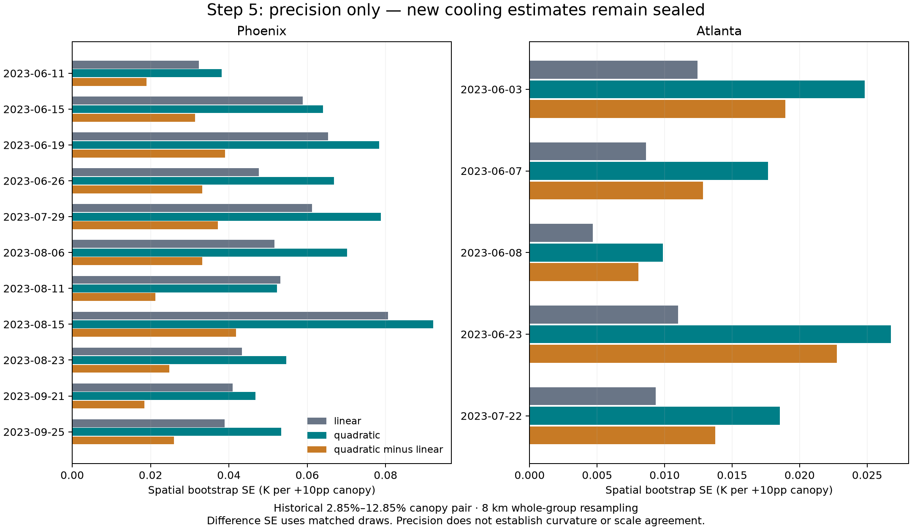

# Step 5 quadratic sensitivity — internal computation complete

Completed 5 October 2026 following the user's explicit request to do the remaining Step 5 fitting. This resolves the earlier fitting-scope question. New effects remain sealed under the user's prior instruction. The primary linear estimator remains unchanged.

**All sixteen quadratic models fitted successfully, and all 32,000 matched spatial resamples were estimable.** The corresponding sixteen linear models reproduce every previously released temperature slope. The sample remains eleven Phoenix and five Atlanta acquisitions from 2023, comprising 7,511,083 cell-pass observations; repeated places are not independent temporal observations.

| Step 5 component | Status |
| --- | --- |
| Predictor support and protected-design audit | Complete on 4 October; preserved |
| Paired temperature/emitted-energy quadratic fits | Complete for all sixteen passes |
| Matched linear-versus-quadratic contrasts and uncertainty | Computed and sealed |
| Curves with original canopy support | 32 sealed figures rendered; machine checks complete |
| Public support/precision and provenance | Complete |
| Visual review of new effect figures and scientific interpretation | Deferred under the explicit sealing instruction |

The authorized internal fitting component is complete. The full Step 5 review is not complete until the new effects can be inspected and interpreted. No technical fitting failure is holding it up. Reza's numerical tolerance remains unset; no scale-agreement ruling is made.

## What was fitted

Each original pass retains its native cells, unit weights, 1 km block intercepts and all six controls: imperviousness, low vegetation, bare cover, buildings, elevation and distance to water. The quadratic model contains both raw canopy `f` and raw `f²`; each term is centred within blocks after squaring. Both canopy terms are protected against deletion in rank checks. All six controls remain in every fitted design.

The linear and quadratic models use the same 1,000 whole-group multiplicity draws at each of 1 km and 8 km. Their paired temperature and emitted-energy outcomes also share those draws. The 32 multiplicity hashes and estimability counts exactly reproduce the preceding predictor-only audit. No failed draw, control or sample was replaced. All sixteen linear point estimates reconcile to the released table within the prospectively recorded numerical tolerance; new linear bootstrap intervals are fresh matched-draw intervals and do not overwrite the old intervals.

Cooling over a +10 percentage-point canopy change is computed from both canopy terms at both endpoints. The quadratic-minus-linear change is computed within each matched draw, preserving covariance. Emitted flux and its temperature equivalent remain diagnostics. Predictions are averaged at fixed reference rows before differencing and exact reference-anchored fourth-root conversion; the historical temperature/emissivity anchor is unchanged. No historical automatic promotion-to-flux rule is used.

## Support and interpretation

All fifteen candidate endpoint pairs and three neighbourhood widths from the predictor audit were retained. Of 240 pass/pair combinations, 158 have at least one original block spanning both endpoints. The remaining 82 are explicitly marked as not estimated for lack of reference blocks. A positive count establishes observed block-range coverage only; it is not a new adequacy threshold or a demonstration of conditional overlap. Thin support is reported rather than hidden by a cutoff. No endpoint pair, pass or original fitting cell was reselected.

The historical approximately 2.85%–12.85% pair has reference blocks in every pass. At ±1pp, only about 2.0%–2.5% of Phoenix observations lie near its upper endpoint, compared with 23.7%–24.9% near the lower endpoint. The previous audit's covariate-overlap limitations therefore still apply. The wide grid includes comparisons with very little Phoenix support; these are labelled exploratory sensitivities and do not support a city ranking.

Each sealed curve has 101 predictor-defined points over the intersection of that city's pass-specific P05–P95 canopy ranges. All original observations remain in fitting. Curve references and displayed ranges differ between cities, so curve endpoints cannot be compared as city cooling efficiencies. Bands are per-pass pointwise spatial-bootstrap intervals, not simultaneous bands or temporal uncertainty. The quadratic model is a bounded sensitivity, not a search across logarithmic or higher-degree models and not an established improvement over the linear model.

## Public precision

At the historical endpoints with 8 km grouping, quadratic temperature-contrast SEs range from about 0.038–0.092 K in Phoenix and 0.010–0.027 K in Atlanta. Matched quadratic-minus-linear SEs range from about 0.018–0.042 K and 0.008–0.023 K respectively. These summarize uncertainty only; they reveal neither the cooling changes nor evidence for curvature. The two city panels use different horizontal scales.

- [Precision table](precision.csv): 3,792 rows; standard errors and interval widths only. No points, interval endpoints, signs or significance results.
- [Retained support](retained_support.csv): 720 rows; unchanged endpoint counts, densities and reference populations.
- [Resampling record](resampling.csv): 32 configurations; physical-group counts, failed indices and draw hashes.
- [Fit diagnostics](fit_diagnostics.csv): sixteen completion records without coefficients.
- [Data dictionary](data_dictionary.md), [completion record](completion.json), [execution freeze](../../docs/v2/v6_2/execution/quadratic_step5_20261005/execution_freeze.json) and [verification](../../docs/v2/v6_2/execution/quadratic_step5_20261005/verification.json).

The sealed directory contains model coefficients/draws, 3,874 finite-contrast table rows (including 82 explicit unsupported combinations), 38,784 curve table rows and 32 comparison images. These were processed programmatically without showing the new effects to the assistant or user. They are intentionally not linked for review in this public packet.

## Verification and remaining boundary

Twelve network-free tests passed, including the known 0.44 K quadratic contrast, independent fixed-effect regression, raw-square centring, protected-term confounding, explicit duplicated-block resampling, sparse-control failure accounting, exact flux conversion, native ownership, paired-difference covariance and sealed serialization. Twenty-one input hashes and eight frozen source-code hashes were verified. Original cell identities, physics, sample counts, endpoint support and all 32 audited draw sequences reconcile.

The public precision figure and a synthetic example of the comparison layout were visually checked. Actual new effect figures remain unviewed; their decoding, dimensions, nonblank content, checksums and restrictive permissions were checked programmatically. Sealed files use mode 0600 in a 0700 directory. No old effect files, raw thermal rasters, empirical time contrasts or additional city/year samples were opened. Cached paired outcomes were accessed solely for the authorized fitting, and the earlier released LST table was read for reconstruction checks.

The previous 48 common-footprint bootstrap failures remain part of Step 3. This run uses the original pass populations and the Step 5 draw plan, so its zero failed draws do not invalidate those failures or prove that every possible resample is estimable. No curvature conclusion, temporal comparison, scale ruling, simulation-effect calibration or study expansion is implied by computational completion.
