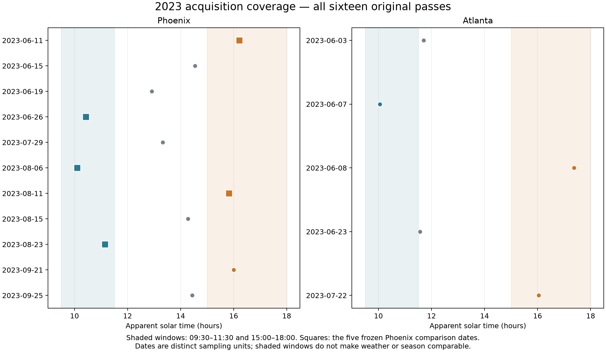
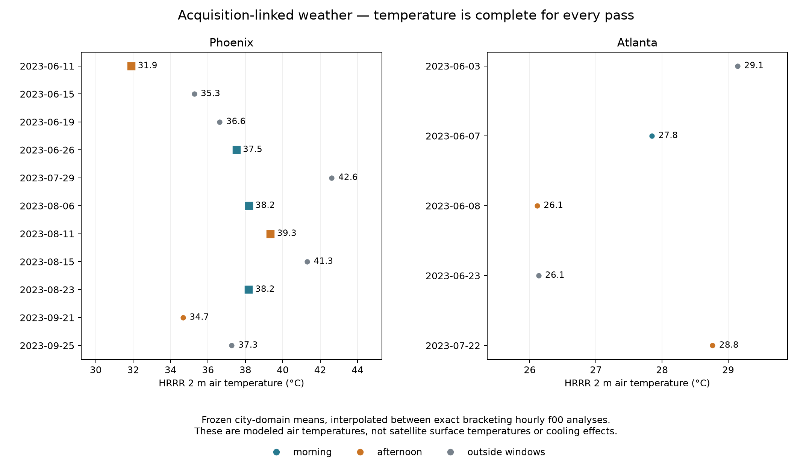
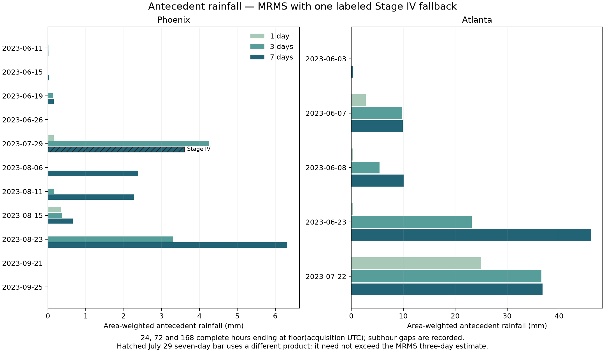

# Step 6 — conditions and comparison inputs

Completed 5 October 2026 under the user's request to proceed with Step 6. All eleven Phoenix and five Atlanta 2023 acquisitions remain in the pilot. This package prepares weather, rainfall, geometry and the existing comparison schedule. It computes no cooling or time effect, opens no sealed model, and leaves all new effects sealed.

**Weather is complete for 16/16 acquisitions. All 48 hour-ended rainfall windows have complete totals: 47 use the primary MRMS product and one uses the separately recorded Stage IV fallback.** Geometry has been audited, with incomplete azimuth and the distinction between city-domain and modeled-cell coverage retained explicitly.

## Phoenix comparison dates and conditions

| Date | Arm | Arm weight | HRRR air temperature, °C | Wind, m/s | 7-day MRMS rainfall, mm |
| --- | --- | ---: | ---: | ---: | ---: |
| June 11 | Afternoon | 0.50 | 31.90 | 6.04 | 0.016 |
| June 26 | Morning | 0.50 | 37.52 | 1.56 | 0.000 |
| August 6 | Morning | 0.25 | 38.19 | 1.59 | 2.378 |
| August 11 | Afternoon | 0.50 | 39.34 | 3.44 | 2.270 |
| August 23 | Morning | 0.25 | 38.18 | 4.37 | 6.324 |

These are modeled city-domain air temperatures and winds, and estimated precipitation—not satellite surface temperatures or canopy effects. The June morning date is about 5.62°C hotter in air temperature than the June afternoon date. Winds differ substantially, and the August dates have different rainfall histories. Matching month and time windows does not establish comparable weather. VPD remains descriptive; no weather adjustment, date exclusion or rain-free cutoff was introduced.

The signed schedule remains +0.50 June 11 +0.50 August 11 −0.50 June 26 −0.25 August 6 −0.25 August 23. Morning is 09:30–11:30 and afternoon is 15:00–18:00 apparent solar time. Each arm totals one; June and August each contribute half of each arm. The other six Phoenix dates remain in the descriptive pilot with zero weight only in this specific sensitivity. No weighted cooling result has been computed here.

Atlanta has one morning and one afternoon acquisition in June under these exact windows, plus one July afternoon acquisition and two June acquisitions outside the windows. No Atlanta contrast or Phoenix-style weighting has been adopted. Phoenix still lacks July and September morning observations in the defined window.

The schedule-only leave-one-date audit preserves the target. Removing June 11, June 26 or August 11 empties a month/arm, making that deletion unsupported. Removing either August morning date leaves the other with morning arm weight 0.50. Thus only two of the five possible deletion schedules remain supported; these are not successful empirical validation folds or additional observations.

## Weather acquisition and provenance

Retrieved 32 exact bracketing hourly NOAA HRRR operational f00 analyses. Only 2 m temperature/dewpoint and 10 m wind components were downloaded using verified GRIB byte ranges. Four fields share the identical grid in every hour, and the forecast/validity times, units and missing-value metadata were checked. Cell centers covered by the frozen Census Urban Area define the domain. Temperature and dewpoint are averaged over those cells; VPD and wind speed are first calculated per cell, then averaged. Hourly domain means are linearly interpolated to each exact acquisition, retaining fractional seconds.

The twenty overlapping cached hourly temperature records and domain counts reconcile exactly. Six dewpoint fields differ by half a float32 rounding unit between the new direct GRIB decode and the inherited extracts. This produces VPD differences no larger than 0.000002165 kPa; reproducing the old float32 decode recovers all cached VPD means within 9×10⁻¹⁶ kPa. The old files are preserved and the new values retain their documented decoding precision.

## Rainfall timing, quality and fallback

The primary product is NOAA **MRMS MultiSensor QPE 01H Pass 2**, archived by Iowa State. GRIB discipline/category/parameter 209/6/37 identifies hourly accumulation in millimetres, as documented in the [NOAA operational tables](https://www.nssl.noaa.gov/projects/mrms/operational/tables.php). Each field's grid and accumulation label were checked. The 0.01-degree cell centers inside each frozen city domain use WGS84 geodesic cell-area weights, fixed across hours. Negative flags and missing pixels remain missing. Every reported complete window has all required hours and all selected domain cells; no temporal or spatial gap was filled.

Totals cover 24, 72 and 168 nonoverlapping hours ending at the last completed UTC hour before acquisition. The gap from that endpoint to acquisition ranges from 0.64 to 58.63 minutes and is recorded per row. **These are hour-ended antecedent descriptors, not exact acquisition-ended totals.** Exact subhourly totals remain unreported; rainfall is neither interpolated nor taken from an hour extending beyond acquisition. Product publication latency is distinct from the accumulation period.

Of 1,873 unique required MRMS hours, 1,872 were retrieved. The July 24 15:00 UTC hour is absent from the checked IEM, NOAA AWS and NCSU MRMS sources. It affects only Phoenix July 29's seven-day window. The primary MRMS total remains explicitly missing. Following the protocol fallback, all 168 hours of that entire window were independently retrieved from NOAA Stage IV through IEM; no single-hour product splice was made. Its 186 fixed Phoenix-domain grid centers use inverse squared polar-stereographic map-scale area weights. The mapping formula was independently verified against projection Jacobians, and kg/m² precipitation was interpreted as mm.

The Stage IV seven-day estimate is 3.600 mm. It is lower than the three-day estimate from MRMS because these are different product estimates, not nested accumulations from one product. They must not be treated as evidence of rainfall decreasing when a window is extended. All fifteen rainfall descriptors for the five Phoenix comparison dates use MRMS and require no fallback.

## Geometry coverage and remaining limitations

All sixteen cached geometry records match the exact acquisition timestamps. Eleven have independently checked nonthermal reconstruction arrays with unique target-cell identities; five additional Phoenix passes have verified view-only evidence summaries. Each archived record reports full view-zenith coverage of its original canonical city-domain target grid. This does not establish coverage on the separate modeled-cell populations, because no direct cell-level crosswalk was constructed in Step 6.

None of the eleven verified arrays has complete joint view/solar azimuth. The measured fraction ranges from zero to 10.59%; five view-only records do not provide an azimuth completeness measurement. The inherited 25° pilot exception remains explicit. Historical 20° eligibility flags were not reapplied to remove passes. Solar zenith and azimuth calculated at city centroids are provided as descriptive geometry, separately from observed sensor geometry; they do not fill missing per-cell azimuth.

## Files and next step

- [Combined conditions](conditions_with_rainfall.csv): sixteen acquisitions, weather, calculated solar geometry and product-labelled rainfall.
- [Rainfall windows](antecedent_rainfall.csv): 48 rows, exact starts/ends, acquisition lag, primary/fallback values and completeness.
- [Hourly weather](hourly_weather.csv), [prior-weather reconciliation](historical_weather_reconciliation.csv), [hourly MRMS summaries](hourly_rainfall.csv) and [rainfall gap/fallback ledger](rainfall_source_gaps.json).
- [Geometry support](geometry_support.csv), [comparison schedule](comparison_schedule.csv), [month/time counts](month_time_coverage.csv) and [leave-one-date schedule](leave_one_date_schedule.json).
- [Data dictionary](data_dictionary.md), [completion](completion.json), [execution freeze](../../docs/v2/v6_2/execution/step6_inputs_20261005/execution_freeze.json), [download provenance](../../docs/v2/v6_2/execution/step6_inputs_20261005/download_manifest.json) and [verification](../../docs/v2/v6_2/execution/step6_inputs_20261005/verification.json).

Twelve network-free checks passed. Thirty-three frozen inputs and 2,200 downloaded source/index files have verified checksums; all 48 totals were independently reconciled by summing fixed-domain hourly means. Public figures were visually checked. An initial ecCodes list-versus-array incompatibility and a final metadata-summary column-name collision were repaired and documented without changing scientific settings. Historical packages, source data and the original execution freeze are preserved.

Step 6 preparation is complete with the stated hourly-rainfall and geometry limits. Step 7 remains separate: compute fixed-date spatial uncertainty using shared physical-group draws, then evaluate what independent-day uncertainty the sparse design can support. Neither these inputs nor the number of pixels establishes a general summer morning–afternoon effect. No empirical time comparison, simulation-effect range, scale verdict, coefficient release or study expansion is authorized or completed by this package.
