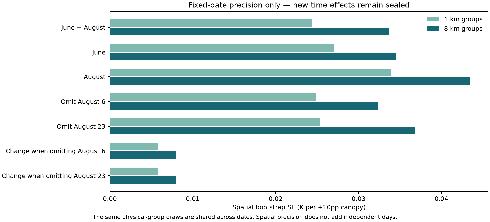
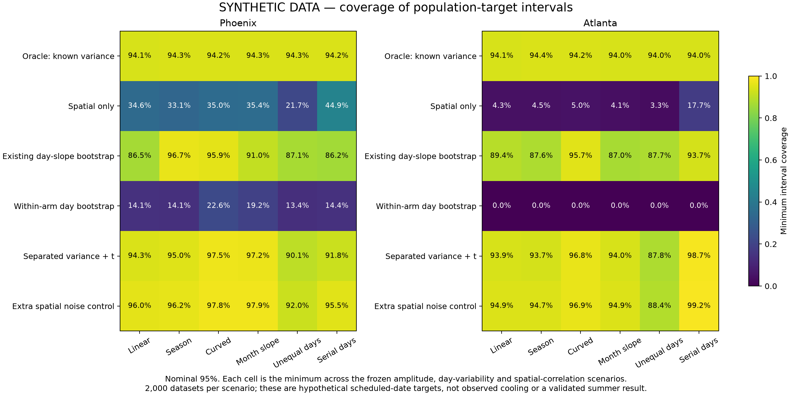

# Step 7 — fixed-date uncertainty and synthetic calibration

Completed 5 October 2026 under “do the next steps” and the continuation “keep going.” New empirical effects remain sealed. The original sixteen 2023 passes, linear canopy models, six controls, reference values and Phoenix comparison weights are preserved.

**The fixed-date computations and calibration are complete. A general summer morning–afternoon interval is not supported by this assessment and has not been adopted.** Effect magnitudes, signs, confidence endpoints and empirical influence plots remain sealed pending authorized review. Computational completion is not a claim of a statistically significant time pattern or scale agreement.

## What was computed internally

Reconstructed all eleven Phoenix and five Atlanta original linear models and recovered every released temperature estimate. For each city, constructed the union of physical 1 km blocks and their 8 km groups. Every resampling draw applies the same physical-group multiplicities to all that city's dates and both outcomes; a group absent from a pass contributes zero. No unrelated archived draw indices were paired. All 32,000 pass-level draws were estimable across four city/group configurations, with no replacements or control removal.

The Phoenix comparison remains:

`0.50 × June11 + 0.50 × August11 − 0.50 × June26 − 0.25 × August06 − 0.25 × August23`.

Computed June, August and combined contrasts; the two supported date-deletion contrasts; and their deletion-minus-full changes. June11, June26 and August11 deletions remain explicitly unsupported because they empty a month/arm. Positive contrasts mean greater canopy-associated cooling on the sampled afternoon dates. They do not isolate a same-day or causal clock effect.

Temperature remains primary. Flux is averaged with the fixed weights within each arm before the exact fixed-reference fourth-root conversion; the afternoon equivalent is then compared with the morning equivalent. Averaging individually converted pass values or converting the signed time-difference flux would define different quantities. The original reference temperature/emissivity are held fixed in every draw. No numerical scale verdict is made.

No empirical Atlanta time contrast was computed. Atlanta's five dates contribute only to its own spatial precision and the separately labeled synthetic design assessment.

## Public precision

| Phoenix comparison | 1 km SE | 8 km SE | 8 km 95% interval width |
| --- | ---: | ---: | ---: |
| June + August | 0.0244 | 0.0337 | 0.1287 |
| June | 0.0270 | 0.0345 | 0.1416 |
| August | 0.0339 | 0.0435 | 0.1682 |

Units are K per +10 percentage points of canopy. These are spatial uncertainty summaries for fixed dates, not intervals over other summer days. Interval centers and endpoints remain sealed. Shared geography is accounted for, but 8 km independence and universal coverage are not established.

## Synthetic assessment — not empirical cooling results

The development phase used 21,600 generated datasets. The unchanged production methods then used independent seeds and bootstrap banks for **216 scenarios × 2,000 datasets = 432,000 generated datasets**. Six methods were assessed on each dataset. Monte Carlo error near 95% coverage is about 0.49 percentage points per scenario; minima across many scenarios are exploratory summaries rather than new acceptance thresholds.

Generators use the actual times, months, date gaps, unequal spatial variances and joint 8 km covariance. Hypothetical linear amplitudes are −0.30, 0 and +0.30 K/+10pp; independent-day SD settings are 0, 0.05 and 0.15 K/+10pp. These are declared assumptions—not estimates from sealed effects, practical-significance thresholds or Reza's tolerance. Scenarios vary seasonal offsets, curved time response, month-specific slopes, unequal day variances and serial day dependence. Some scenarios coincide when their day variance is zero. Spatial covariance is either the measured joint matrix or its diagonal.

The population target is the expected weighted contrast at the specified sampling schedule under each imposed generator. The realized-date target additionally contains those simulated dates' random deviations. Neither is a model-free target for all summer days. Atlanta's synthetic-only target uses its June7 morning and June8 afternoon dates; this is not an adopted empirical Atlanta comparison.

| Method: nominal 95% population-target interval | Phoenix coverage range | Atlanta coverage range |
| --- | ---: | ---: |
| Existing day-slope bootstrap | 86.2%–100% | 87.0%–100% |
| Candidate separating spatial and day variance, with t interval | 90.15%–100% | 87.8%–100% |
| Resample dates within the fixed month/arms | 13.4%–81.8% | 0% |
| Oracle given the true simulated variance | 94.1%–96.55% | 94.0%–96.3% |

The unweighted candidate subtracts the known spatial contribution from residual dispersion once, estimating a nonnegative common day variance after month intercepts and linear time. It has six residual degrees of freedom in Phoenix and two in Atlanta. Its assumptions are under assessment; it is not REML, Hartung–Knapp or a validated replacement model. Small-sample uncertainty in variance estimation warrants explicit evaluation rather than reliance on a variance plug-in alone; see the [simulation study by Partlett and Riley](https://pmc.ncbi.nlm.nih.gov/articles/PMC5157768/). No empirical general-day interval was fitted using this candidate.

The oracle averages 95.06% population coverage, and spatial-only intervals average 95.05% coverage of the realized-date target under the imposed Gaussian error model. Spatial-only population coverage falls as low as 21.7% in Phoenix and 3.3% in Atlanta when day variation is ignored. This illustrates the difference between the two targets; it does not validate the real empirical percentile bootstrap or prove the assumed spatial covariance is correct. The simulations treat the estimated covariance as fixed and known.

## What did not work reliably

- The existing day-slope benchmark retains a linear-time interpretation. It agrees with the weighted-window target only under appropriate mean assumptions. In the production bank, 232/499 Phoenix draws and 293/497 estimable Atlanta draws place an arm-mean time outside the resampled time range. Two additional Atlanta draws are rank deficient and are reported without replacement.
- Respectively 413/499 and 293/497 estimable day draws omit at least one month/arm required by the synthetic window target. These are support diagnostics; no draws were removed to improve coverage.
- Within-arm date resampling cannot learn variability in a singleton arm. Atlanta's synthetic June comparison has one date per arm, so this bootstrap produces zero-width intervals; Phoenix retains only the two August morning dates as within-arm replication.
- The separated-variance candidate still undercovers when day variation differs between arms. Its worst tested coverage is 90.15% for Phoenix and 87.8% for Atlanta. A deliberately duplicated-spatial-noise control generally widens intervals, but extra noise is not a principled repair for incorrect day-variance assumptions.

The Step6 weather differences, rainfall timing and geometry limitations also persist. No date, canopy cutoff, endpoint, reference or model was changed to improve a result. The quadratic model remains a separate sensitivity; it was not promoted into the time comparison.

## Files and remaining decisions

- [Fixed-date precision](fixed_date_precision.csv), [resampling audit](resampling_audit.json), [unsupported deletions](unsupported_deletions.json) and [empirical completion](empirical_completion.json).
- [Synthetic production results](SYNTHETIC_DATA_production_calibration.csv), [known synthetic targets](SYNTHETIC_DATA_production_truth.csv), [day-bootstrap audit](SYNTHETIC_DATA_production_bank_audit.json) and [month/arm support audit](SYNTHETIC_DATA_month_arm_support.json).
- [Data dictionary](data_dictionary.md), [methods and captions](methods_and_captions.md), and [next-observation proposal](next_observation_proposal.md).
- [Execution freeze](../../docs/v2/v6_2/execution/step7_window_20261005/execution_freeze.json) and [verification](../../docs/v2/v6_2/execution/step7_window_20261005/verification.json).

Thirteen network-free tests and 22 frozen input/11 source-code checks passed. The tests include independent repeated-block fits, reordered and absent physical groups, exact transformation order, paired covariance, unchanged benchmark recovery, variance separation, oracle coverage and sealed-output protection. The new empirical effect figures were rendered and checked programmatically without visual inspection. Public precision and synthetic figures were visually reviewed; all synthetic artifacts remain distinctly labeled.

The authorized numerical work is complete. Effect review remains pending under the sealing instruction; Reza's tolerance is unset. The next-observation document is a proposal, not acquisition or expansion approval. No new city/year processing, external message, commit or push occurred.
