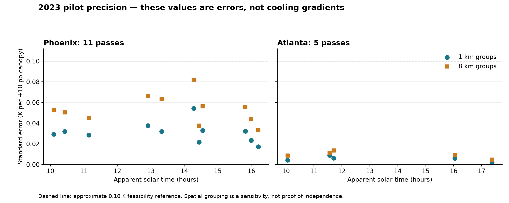
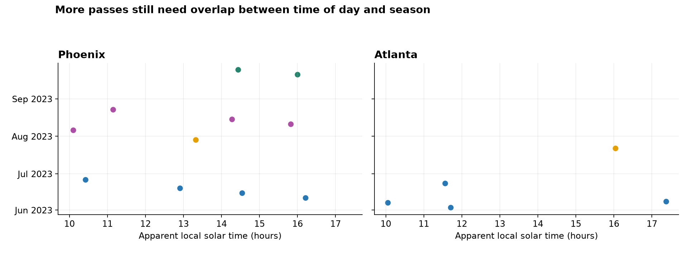

# v6.2: 2023 pilot review for Prof. Alizadeh

**Current main pilot: 11 Phoenix + 5 Atlanta passes, all ECOSTRESS acquisitions from 2023.** Seven processed Phoenix passes from other years are a separate exploratory extension, excluded from the main pilot. Protocol version remains 6.2.

This package is organized for precision/method review. It contains no empirical cooling point estimates, fitted time-contrast values, raw outcome cells or credentials. Previously viewed exploratory gradients do not make the study globally blinded; their access history is acknowledged in the decisions note. Synthetic outputs are explicitly labeled and kept separate.

## Start here

1. [Progress, methods, limitations and decisions](01_Progress_and_decisions.md)
2. [Literature and proposed refinements, with direct article citations](02_Literature_and_proposals.md)
3. [All 16 pilot pass identities, observation times, precision and support](tables/pilot2023_precision_and_passes.csv)
4. [Reproducibility and evidence guide](03_Reproducibility.md)

The new paired estimator uses one canopy slope per city/pass and block-specific intercepts, without the retired per-block canopy-span gate. Matching native cells, covariates and bootstrap draws are used for LST and M = epsilon_WB × sigma × T^4. Units are K or W/m² per +10 percentage points of canopy. The interpretation is canopy-associated mixed-pixel surface cooling.

| Pilot city | Passes | 1 km-group SE range | 8 km-group SE range |
|---|---:|---:|---:|
| Phoenix | 11 | 0.0173–0.0542 | 0.0332–0.0815 |
| Atlanta | 5 | 0.0023–0.0089 | 0.0048–0.0135 |

SE units are K per +10 percentage points canopy. These are precision diagnostics, not cooling magnitudes, retrieval accuracy or confirmation of a time effect.

## Sampling is still the main limitation

Phoenix's complete 2023 June–September catalogue has no July or September acquisition in the 09:30–11:30 apparent-solar-time window, before quality screening. All eleven Phoenix observations remain descriptive. A proposed month-balanced window sensitivity uses five existing endpoint passes in June/August; each month receives half of each arm's weight. Three middle-time passes inform shape; the three July/September passes have no matched morning counterpart. [Exact roles and weights](tables/phoenix2023_sampling_roles.csv).

This is not a fully balanced June–September design, nor an exact 10:30-versus-16:00 estimate. Weather and dates still differ within months. No new empirical time model has been fitted to the eleven-pass expansion. Earlier original-pilot time uncertainty is provisional because its bootstrap needs correction. The original secondary geometry/season-standardized contrast lacked support in both cities.

## Additional evidence

- [Original and added-pass precision, ownership and residual diagnostics](evidence/README.md)
- [Synthetic mixing outputs and exact conversion](notes/Mixing_and_standardization.md)
- [Candidate-city screen](notes/Candidate_cities.md), [numeric results](tables/candidate_city_screen.csv), [figure](figures/candidate_city_screen.png)
- [Los Angeles readiness](notes/Los_Angeles_readiness.md)
- [Separate other-year exploration](exploratory_other_years/README.md)
- [Detailed pilot plan](protocol/pilot_plan_v6_2.md), [implementation record](protocol/implementation_plan_v6_2.md), and [2023 scope clarification](protocol/phoenix_2023_sample_scope.md)
- [Current machine-readable protocol](protocol/protocol_v6_2.yml); `current_pilot_scope_20260921` controls current scope, with historical records retained.

Scale agreement awaits a substantive tolerance and a valid, supported temporal comparison. Full-city/multi-city thermal scaling, eight-class unmixing and confirmatory VPD claims are not part of this packet. Source layers, sealed model storage and correspondence remain local.
