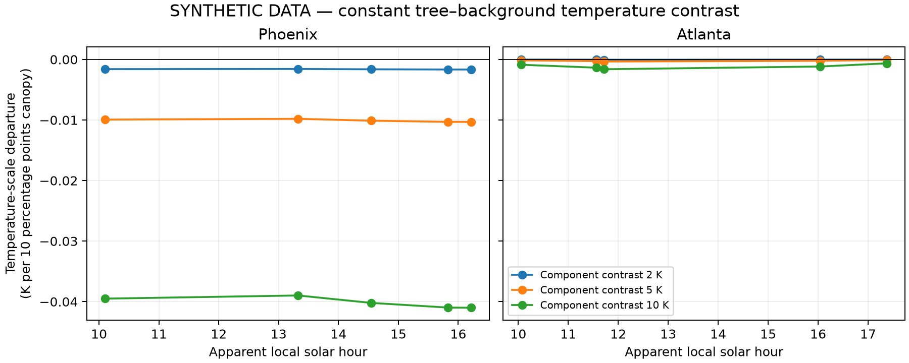

> Historical original-ten-pass implementation record. The temporal-bootstrap uncertainty described below is now provisional following the double-noise audit. The numerical mixing/reference procedure remains documented; no empirical contrast values are included.

# Mixing test and standardized conversion

The frozen reference pair is f0 = 0.028510, f1 = 0.128510; Tref = 314.7740 K and epsilon_ref = 0.947400. Pair selection used canopy and block labels only: maximize the minimum number of supporting reference blocks across the ten passes, breaking ties toward smaller f0. These reference restrictions do not remove other blocks from the slope fit. Numerical anchors are equal-city means of equal-pass medians. Aggregate absolute-temperature access is disclosed separately from coefficient release.

For each city-pass, replace raw canopy by f0 and f1 in its frozen reference rows, subtract the original training block means, and retain all other covariates and valid block intercepts. Compute the weighted mean predicted M at each endpoint. With dM = mean Mhat(f1) − mean Mhat(f0), set Mref = epsilon_ref × sigma × Tref⁴ and calculate:

Delta T_equiv = [(Mref + dM)/(epsilon_ref × sigma)]^(1/4) − Tref.

Require positive anchored emission. Positive cooling is −Delta T_equiv. Average predictions before inverting; do not use a universal divisor. Reapply the transformation in each paired bootstrap draw with references fixed. Reference sensitivity uses Tref ±10 K and epsilon_ref ±0.01, capped at 0.999. Empirical prediction levels and contrasts stay sealed.

The primary time comparison is a prespecified city-specific linear pattern between 10:30 and 16:00 apparent local solar time. Both targets must lie inside each city’s observed range. An equal-city mean is calculated only for two supported city contrasts. Stage 1 uncertainty is propagated alongside independent-day resampling, with 1km and 8km spatial-uncertainty variants. Five passes per city support an exploratory feasibility comparison; they do not reconstruct a same-day diurnal curve. The secondary model adds solar elevation and day of year only when joint convex-hull support and residual degrees of freedom permit it.

| city | variant | status | reason |
| --- | --- | --- | --- |
| phoenix | total | COMPUTED_SEALED |  |
| phoenix | total_spatial8km | COMPUTED_SEALED |  |
| phoenix | geometry_season | NOT_ESTIMABLE | Secondary geometry/season common support absent |
| atlanta | total | COMPUTED_SEALED |  |
| atlanta | total_spatial8km | COMPUTED_SEALED |  |
| atlanta | geometry_season | NOT_ESTIMABLE | Secondary geometry/season common support absent |

The synthetic test uses 200 reproducibly sampled whole blocks per pass, constant component contrasts of 0, 2, 5 and 10 K, and 100 spatial bootstrap draws. Background temperatures and equal-component emissivities in the no-noise scenario are observed block medians, which remove the empirical canopy-temperature association. A within-block permutation sensitivity retains observed temperature distributions without republishing a sealed empirical regression as a zero-control simulation. Additional scenarios add correlated error, unequal component emissivity, narrower canopy support and ±10 K background shifts. Exact component temperatures are assumptions, not retrieved canopy temperatures.

The matched zero-contrast control is subtracted to isolate transformation departures from the known linear-temperature benchmark, 0.10 × component contrast. A fixed component temperature difference need not yield a fixed energy difference; the standardized energy-space variation is therefore not automatically a spurious effect.

| constant_contrast_K | T_cross_pass_range_K_per_10pp | T_city_mean_difference_atlanta_minus_phoenix | max_abs_transformation_departure_K_per_10pp |
| --- | --- | --- | --- |
| 0 | 0.000000 | 0.000000 | 0.000000 |
| 2 | 0.001648 | 0.001592 | 0.001656 |
| 5 | 0.010224 | 0.009878 | 0.010313 |
| 10 | 0.040363 | 0.039002 | 0.041003 |

[All synthetic scenarios](../tests/fixtures/synthetic_demo/mixing_20260919/SYNTHETIC_DATA_mixing_summary.csv) and [synthetic time comparisons](../tests/fixtures/synthetic_demo/mixing_20260919/SYNTHETIC_DATA_time_comparison.csv). These are simulated diagnostics and do not disclose the empirical cooling effect or settle the headline-scale decision.

Simulated 10:30-to-16:00 time contrasts under constant component contrasts (K per 10 percentage points):

| city | constant_contrast_K | artificial_time_contrast_T | time_contrast_M_equivalent |
| --- | --- | --- | --- |
| atlanta | 2 | 0.000013 | -0.009380 |
| atlanta | 5 | 0.000080 | -0.023297 |
| atlanta | 10 | 0.000306 | -0.046074 |
| phoenix | 2 | -0.000063 | -0.021904 |
| phoenix | 5 | -0.000389 | -0.054433 |
| phoenix | 10 | -0.001534 | -0.107761 |

Energy-equivalent time variation includes the physical change in emitted energy with baseline temperature; it is not all temperature-transformation artifact.
